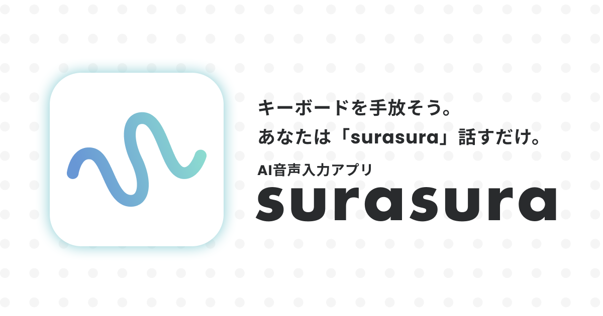

# surasura

AI音声入力アプリ「**surasura**」

surasuraは、OpenAI APIを使った音声入力デスクトップアプリです。
Whisperによる高精度な音声認識と、GPTによるインテリジェントなテキスト整形機能を提供します。

サイトは[こちら](https://www.sura2.net)です。

## ベースプロジェクト

本プロジェクトは [Amical](https://github.com/amicalhq/amical) をベースに開発されています。開発者の皆様に感謝いたします。

## 主な機能

### 音声入力

- **Push to Talk** - キーを押している間だけ録音
- **ハンズフリーモード** - 1回押すと開始、もう1回押すと停止
- **履歴ペースト** - 直前の文字起こし結果を再度ペースト
- **録音キャンセル** - 録音中にキャンセル可能

### AIフォーマット

- 文字起こし結果をGPTで自動整形
- ビジネスメール、議事録、カジュアルな文体など、用途に応じたフォーマット

### 辞書機能

- カスタム単語の登録で認識精度を向上
- 置換ルールの設定（例：「すらすら」→「surasura」）

辞書には2つのモードがあり、それぞれ異なる段階で使用されます。

**認識ヒントモード（置換なし）**

専門用語や固有名詞など、正しく認識させたい単語を登録します。

- 音声認識（Whisper）: 認識のヒントとして使用
- AIフォーマット: 修正時の参考として使用

**置換モード（置換あり）**

特定の単語を別の表記に自動変換したい場合に使用します。

- フォーマット完了後、保存直前に正規表現で確実に置換

| 処理段階       | 認識ヒント | 置換  |
| -------------- | :--------: | :---: |
| 音声認識       |     ✅      |   -   |
| AIフォーマット |     ✅      |   -   |
| 最終置換処理   |     -      |   ✅   |

### カスタマイズ

- すべてのショートカットキーをカスタマイズ可能
- フローティングウィジェットで素早く録音開始
- ライト/ダーク/システムテーマに対応
- 効果音のオン/オフ切り替え

## 対応プラットフォーム

- macOS (Apple Silicon / Intel)
- Windows

## 必要なもの

- OpenAI APIキー

## インストール

[公式サイト](https://www.sura2.net) または [Releases](https://github.com/tkcel/surasura/releases)ページから最新版をダウンロードしてください。

## コミュニティ

ご意見・ご要望・バグ報告などは [Discord サーバー](https://discord.gg/ffpmWv5d) までお気軽にどうぞ。

> **Note**
> 本プロジェクトは個人で開発・運営しているため、IssueやPull Requestへの対応、返信が遅れる場合があります。ご了承ください。

## ライセンス

surasura 非商用ライセンス

本ソフトウェアは個人利用、教育目的、研究目的、非営利団体による非商用目的での使用が許可されています。商用利用は禁止されています。

商用利用をご希望の場合は、t.nemoto@kyo-toku.com までお問い合わせください。

詳細は [LICENSE](./LICENSE) をご確認ください。

---

本プロジェクトは [Amical](https://github.com/amicalhq/amical)（MITライセンス）をベースに開発されています。
オリジナルのライセンスについては [LICENSE_ORIGINAL_AMICAL](./LICENSE_ORIGINAL_AMICAL) を参照してください。
