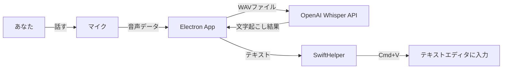
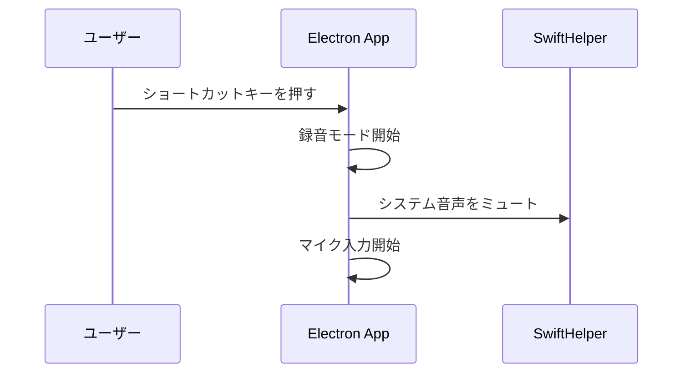
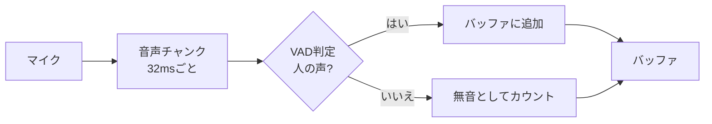
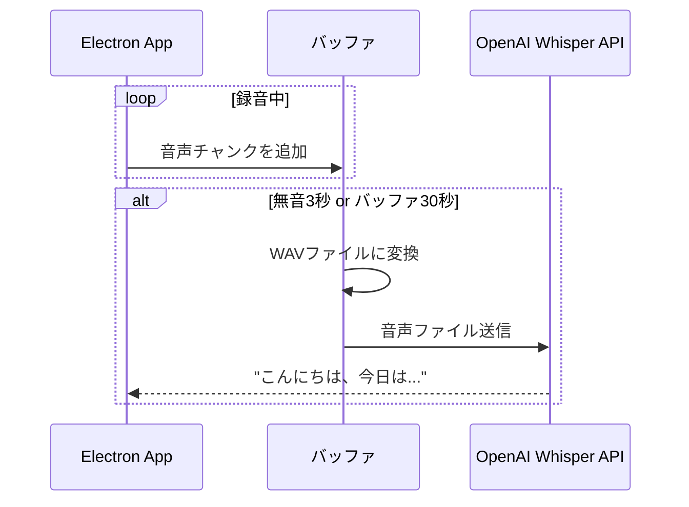
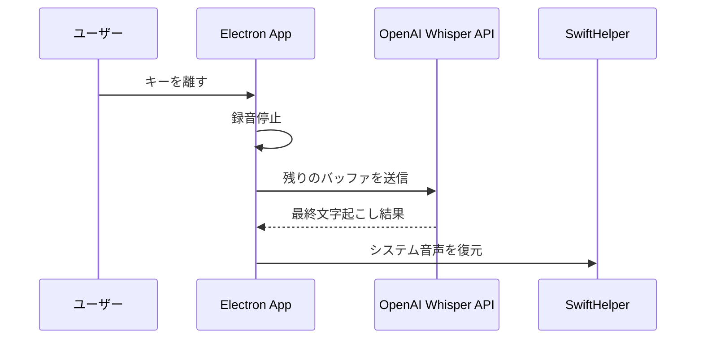
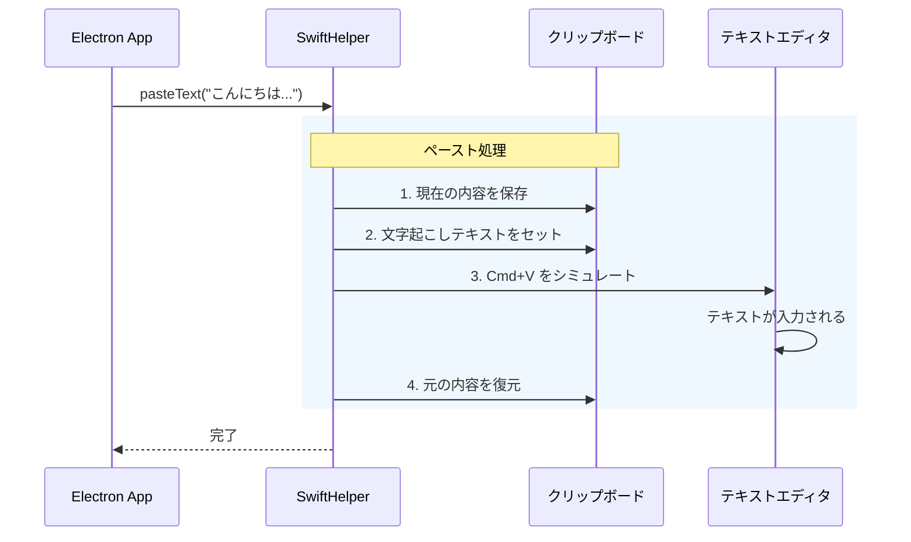
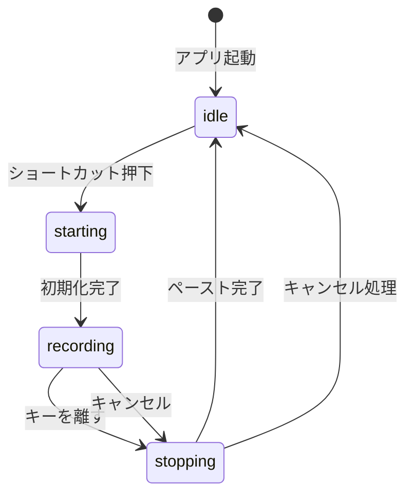
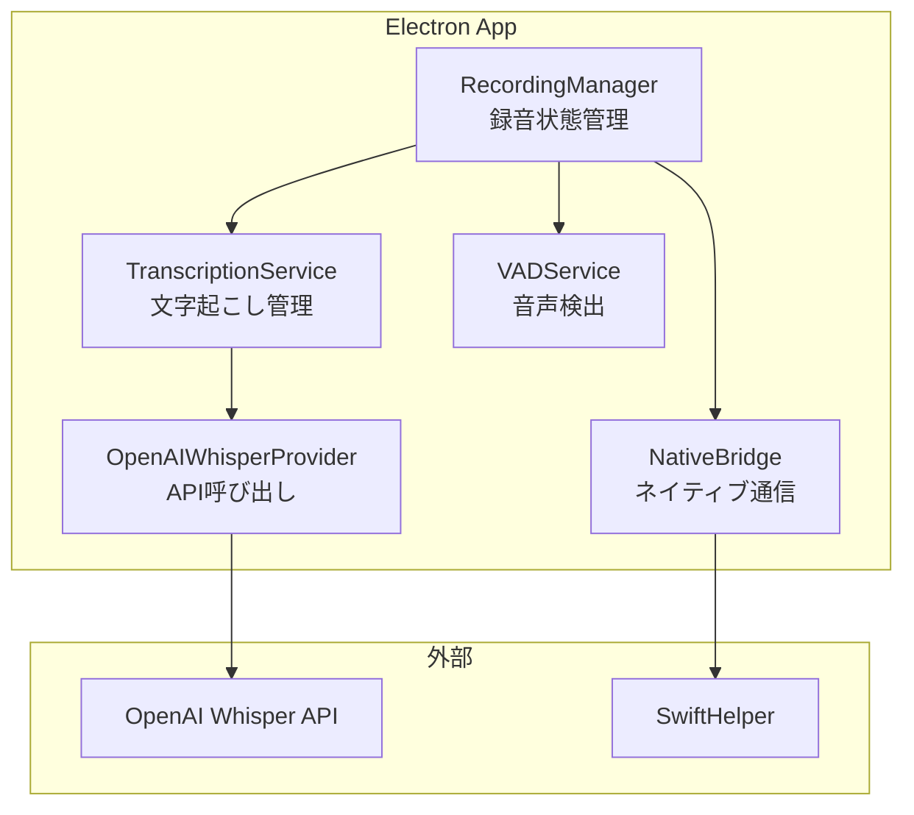
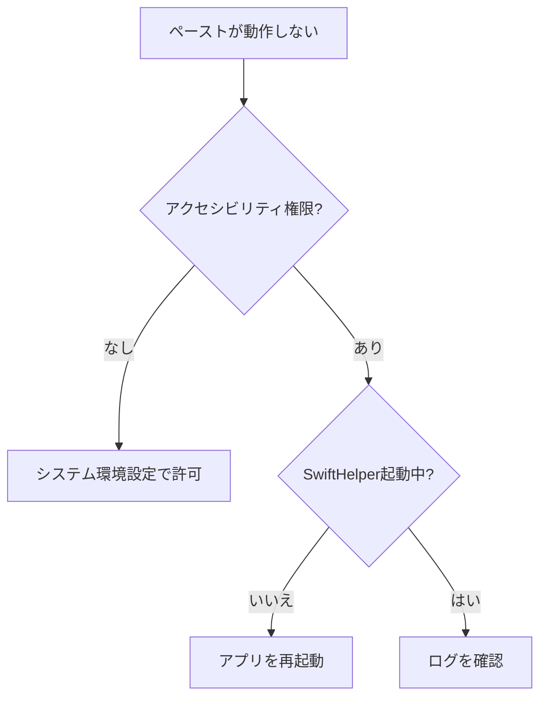
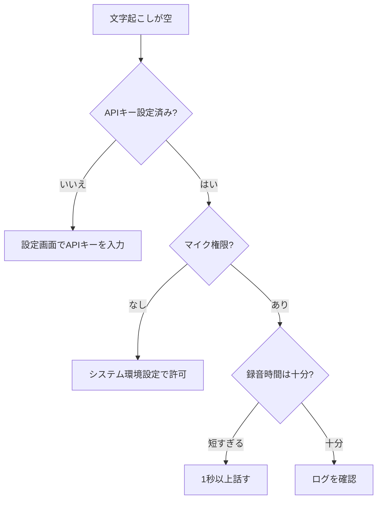

# 音声認識からテキスト入力までのフロー

このドキュメントでは、Surasuraアプリケーションが音声を録音し、文字起こしを行い、カーソル位置にテキストをペーストするまでの仕組みを説明します。

## 概要図

---

## 処理の流れ

### 1. 録音開始

ユーザーがキーボードショートカット（例: `Cmd+Shift+Space`）を押すと、アプリが「録音モード」に入ります。

この時、裏で起きていること:
- システム音声をミュート（自分の声だけ拾うため）
- マイクからの音声取り込み開始

---

### 2. 音声の取り込みと処理

マイクから入ってきた音声は、**32ミリ秒ごと**に小さなチャンク（塊）として処理されます。

VAD（Voice Activity Detection）が「今しゃべってるか、黙ってるか」を判定して、無駄なAPIコールを減らします。

---

### 3. OpenAI Whisper APIへ送信

音声チャンクはバッファに溜められて、以下のタイミングでOpenAI Whisper APIに送信されます:

| 条件 | 説明 |
|-----|------|
| 3秒間の無音 | 話し終わったと判断 |
| 30秒分のバッファ | 長い発話の場合 |

---

### 4. 録音終了

ユーザーがキーを離す（またはトグルで再度押す）と、録音が終了します。

この時:
1. 残っている音声バッファを全部APIに送信
2. 全ての文字起こし結果を結合
3. システム音声を元に戻す

---

### 5. テキストのペースト

文字起こし結果を**今カーソルがある場所**にペーストします。

これは**SwiftHelper**というmacOSネイティブアプリが担当しています。

#### ペースト処理の詳細

#### なぜSwiftHelperが必要？

Electronアプリから直接他のアプリにテキストを入力することはできません。macOSのセキュリティ制限があるためです。

そこで、**アクセシビリティ権限**を持ったネイティブアプリ（SwiftHelper）を使って、キーボード操作をシミュレートしています。

---

## 録音状態のステートマシン

アプリは以下の状態を遷移します:

| 状態 | 説明 |
|-----|------|
| `idle` | 待機中。録音していない |
| `starting` | 録音準備中。マイク・VAD初期化 |
| `recording` | 録音中。音声を取り込んでいる |
| `stopping` | 録音終了処理中。文字起こし・ペースト実行 |

---

## 主要コンポーネント

| コンポーネント | 役割 |
|--------------|------|
| RecordingManager | 録音の開始・停止・状態管理 |
| VADService | 音声活動検出（話してるか判定） |
| TranscriptionService | 文字起こしセッション管理 |
| OpenAIWhisperProvider | OpenAI APIへの送信・WAV変換 |
| NativeBridge | SwiftHelperとの通信 |
| SwiftHelper | macOSでのペースト実行 |

---

## 設定

| 設定項目 | デフォルト値 | 説明 |
|---------|------------|------|
| 言語 | 日本語 (`ja`) | Whisper APIに渡す言語コード |
| OpenAI APIキー | - | 必須。オンボーディングまたは設定画面で入力 |

---

## トラブルシューティング

### ペーストが動作しない場合

**確認ポイント:**
1. システム環境設定 > プライバシーとセキュリティ > アクセシビリティ でSurasuraが許可されているか
2. アプリを再起動してSwiftHelperが起動するか確認

### 文字起こしが空の場合

**確認ポイント:**
1. 設定画面でOpenAI APIキーが正しく入力されているか
2. システム環境設定 > プライバシーとセキュリティ > マイク でSurasuraが許可されているか
3. 最低1秒以上は話してから録音を終了する
