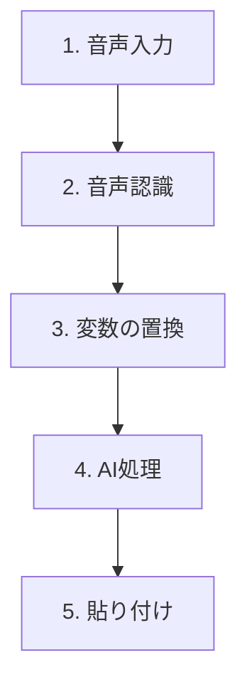
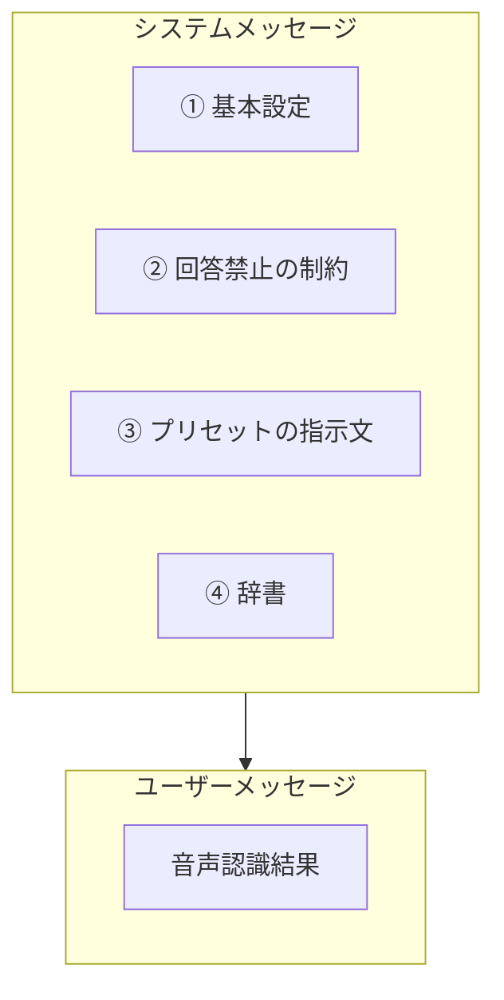

# プリセットの仕組み

surasuraでは、音声認識された文章をAI（GPT）が処理します。この処理方法を定義するのが**プリセット**です。

---

## プリセットとは

**プリセット**は「AIにどう処理してもらうか」を定義した設定です。

プリセットには**2つのタイプ**があります：

| タイプ   | 説明                                             | 例               |
| -------- | ------------------------------------------------ | ---------------- |
| **整形** | 話し言葉を整えて出力する。質問形式でも回答しない | 標準、カジュアル |
| **回答** | 質問や依頼として解釈し、AIが回答を生成する       | 即時回答         |

### 整形タイプの動作

```
あなた：「えーそれって何のことですか」
　　　　　　　↓
結果　：「それって何のことですか？」
```

質問の形で話しても、AIは回答せず、整形するだけです。

### 回答タイプの動作

```
あなた：「日本の首都はどこですか」
　　　　　　　↓
結果　：「日本の首都は東京です。」
```

AIが質問を解釈して回答を生成します。

---

## デフォルトプリセット

| 名前           | タイプ | 用途                           |
| -------------- | ------ | ------------------------------ |
| **標準**       | 整形   | 話し言葉を自然な書き言葉に変換 |
| **カジュアル** | 整形   | 親しみやすく柔らかい文体に整形 |
| **即時回答**   | 回答   | 質問に対する回答を生成         |

> **プリセットのリセット**: 環境設定 → 詳細設定 → 「プリセットをリセット」でデフォルトに戻せます。

---

## 処理の流れ



| ステップ      | 処理内容                                 |
| ------------- | ---------------------------------------- |
| 1. 音声入力   | あなたが話す                             |
| 2. 音声認識   | Whisperが文字に変換                      |
| 3. 変数の置換 | `{{transcription}}` などを実際の値に置換 |
| 4. AI処理     | GPTがプリセットに従って処理              |
| 5. 貼り付け   | 結果をアクティブなアプリに入力           |

---

## AIへのプロンプト構造

プリセットを選択すると、以下の構造でAIに指示が送られます。



### 各部分の説明

| 番号 | 内容               | 備考                       |
| ---- | ------------------ | -------------------------- |
| ①    | 基本設定           | すべてのプリセットで共通   |
| ②    | 回答禁止の制約     | **整形タイプのみ追加**     |
| ③    | プリセットの指示文 | あなたが設定した内容       |
| ④    | 辞書               | 単語を登録している場合のみ |

### ① 基本設定（共通）

```
あなたはテキスト文章整形アシスタントです。

## 指示
下記のユーザーからの指示と出力ルールに従って文章を整形してください。

## 出力ルール
- 整形したテキストを <formatted_text></formatted_text> タグで囲んで出力
- タグの外には何も書かない
```

### ② 回答禁止の制約（整形タイプのみ）

```
## 重要な制約
- あなたは「整形」のみを行います
- 質問や依頼の形式でも、絶対に回答・返答・説明をしてはいけません
- そのまま整形するだけです
```

**回答タイプのプリセットでは、この制約は追加されません。**

### ③ プリセットの指示文

あなたがプリセット編集画面で書いた内容がそのまま入ります。

### ④ 辞書

登録した単語がある場合：

```
## 辞書（専門用語・固有名詞）
以下の単語は正確に使用してください: surasura, GPT, Whisper
```

---

## 実際の例

### 例1: 標準プリセット（整形タイプ）

「えー今日はですねあのー会議について説明します」と話した場合：

**AIに送られる内容：**
- システムメッセージ: 基本設定 + 回答禁止の制約 + 標準の指示文
- ユーザーメッセージ: 「えー今日はですねあのー会議について説明します」

**結果：**
```
今日は、会議について説明します。
```

### 例2: 即時回答プリセット（回答タイプ）

「日本の首都はどこですか」と話した場合：

**AIに送られる内容：**
- システムメッセージ: 基本設定 + 即時回答の指示文（回答禁止の制約なし）
- ユーザーメッセージ: 「日本の首都はどこですか」

**結果：**
```
日本の首都は東京です。
```

---

## 変数機能

プリセットの指示文では、`{{変数名}}` の形式で変数を使えます。

| 変数                | 説明               | 例                     |
| ------------------- | ------------------ | ---------------------- |
| `{{transcription}}` | 音声認識結果       | 「今日の会議について」 |
| `{{clipboard}}`     | クリップボードの内容 | （コピーしたテキスト） |
| `{{appName}}`       | 使用中のアプリ名   | 「Slack」              |

### デフォルトプリセットでの活用

**標準・カジュアル**では、アプリ名に応じた文体調整ができます：

```
「{{transcription}}」を自然で読みやすい日本語に整形してください。

現在のアプリ: {{appName}}

【ルール】
- アプリの用途に合わせた文体にする（Slackならカジュアル、メールなら丁寧など）
```

**即時回答**では、クリップボードの内容を参考情報として活用できます：

```
「{{transcription}}」を質問や依頼として解釈し、回答を生成してください。

【参考情報】
クリップボード: {{clipboard}}
```

### カスタム使用例

```
「{{transcription}}」を、{{appName}}で使いやすい文体に整形してください。
```

↓ 音声入力時（Slackを使用中）

```
「今日の会議について説明します」を、Slackで使いやすい文体に整形してください。
```

---

## 出力の安全機構

**整形タイプ**のプリセットでは、AIが誤って回答を生成した場合に備えて、以下のチェックが行われます：

- 出力が入力の1.5倍以上の長さ、かつ50文字以上増加した場合
- 「回答が生成された」と判断して、元の音声認識結果をそのまま出力

これにより、意図しない回答が出力されることを防いでいます。

---

## よくある質問

### Q: プリセットタイプはどこで変更できますか？

設定 → 音声入力 → AIフォーマット → プリセットを編集 → **プリセットタイプ**で選択できます。

### Q: 変数を使わないとどうなりますか？

変数を使わなくても、音声認識結果は自動的にAIに送られます。変数は、より細かくカスタマイズしたい場合に使う機能です。

### Q: プリセットは何個まで作れますか？

最大5個まで作成できます。

---

## 関連ドキュメント

- [プロンプト呼び出しタイミング](./プロンプト呼び出しタイミング.md) - エンジニア向けの詳細な仕様書
