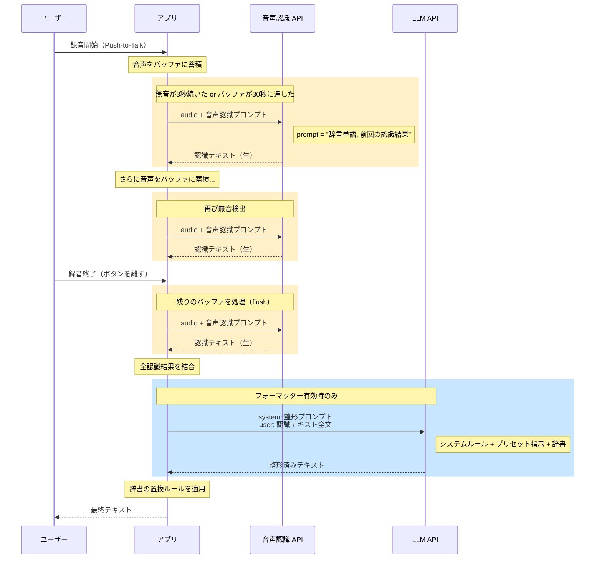
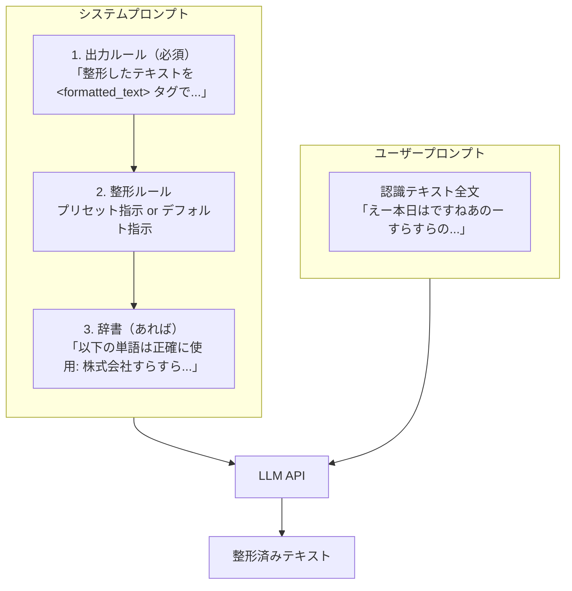
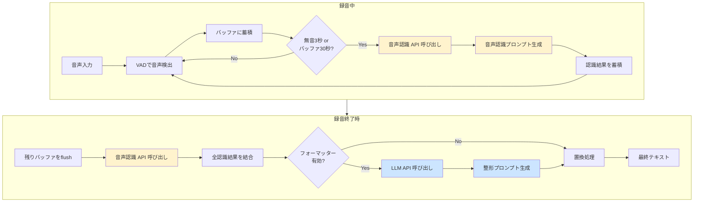

# プロンプト呼び出しタイミング

音声入力の処理中に、いつ・どのプロンプトが・どのように使われるかを説明します。

---

## 概要

音声入力では **2種類のプロンプト** が使われます：

| プロンプト | 使用API | タイミング | 目的 |
|-----------|---------|-----------|------|
| **音声認識プロンプト** | OpenAI Whisper API | 録音中（無音検出時） | 音声認識の精度向上 |
| **整形プロンプト** | OpenAI Chat API (GPT) | 録音終了後 | テキスト整形 |

---

## タイムライン



---

## 1. 音声認識プロンプト

### 呼び出しタイミング

| トリガー | 条件 |
|---------|------|
| **無音検出** | 3秒間無音が続いた |
| **バッファ上限** | バッファが30秒分に達した |
| **録音終了** | ユーザーがボタンを離した（flush） |

録音中に何度も呼ばれる可能性があります。

### プロンプトの構成

```
[辞書の単語（カンマ区切り）] [前回までの認識テキスト]
```

**例：**
```
株式会社すらすら, API連携, マイクロサービス 本日の議題は
```

### コード

```typescript
// openai-whisper-provider.ts

private generateRecognitionPrompt(
  vocabulary?: string[],           // 辞書の単語
  aggregatedTranscription?: string // 前回までの認識テキスト
): string {
  const promptParts: string[] = [];

  if (vocabulary && vocabulary.length > 0) {
    promptParts.push(vocabulary.join(", "));
  }

  if (aggregatedTranscription) {
    promptParts.push(aggregatedTranscription);
  }

  return promptParts.join(" ");
}
```

### 効果

- 辞書の単語を優先的に認識する
- 文脈を引き継いで一貫性のある認識ができる

---

## 2. 整形プロンプト

### 呼び出しタイミング

| トリガー | 条件 |
|---------|------|
| **録音終了時** | フォーマッターが有効 かつ 認識テキストが空でない |

録音終了後に **1回だけ** 呼ばれます。

### プロンプトの構成



### コード

```typescript
// formatter-prompt.ts

// 最小限のシステムプロンプト（出力形式のルールのみ）
const SYSTEM_PROMPT = `あなたはテキスト整形アシスタントです。

## 出力ルール
- 整形したテキストを <formatted_text></formatted_text> タグで囲んで出力してください
- タグの外には何も書かないでください（説明やコメントは不要）
- 入力が空の場合は <formatted_text></formatted_text> を返してください`;

export function constructFormatterPrompt(context, preset) {
  const parts = [SYSTEM_PROMPT];

  // プリセットの指示、なければデフォルト指示を使用
  const instructions = preset?.instructions?.trim() || DEFAULT_INSTRUCTIONS;
  parts.push(`\n## 整形ルール\n${instructions}`);

  // 辞書があれば追加
  if (vocabulary?.length > 0) {
    parts.push(`\n## 辞書（専門用語・固有名詞）\n以下の単語は正確に使用してください: ${vocabulary.join(", ")}`);
  }

  return { systemPrompt: parts.join("\n") };
}
```

### プロンプト例

**システムプロンプト（「標準」プリセット選択時）：**
```
あなたはテキスト整形アシスタントです。

## 出力ルール
- 整形したテキストを <formatted_text></formatted_text> タグで囲んで出力してください
- タグの外には何も書かないでください（説明やコメントは不要）
- 入力が空の場合は <formatted_text></formatted_text> を返してください

## 整形ルール
音声認識結果を自然で読みやすい日本語に整形してください。

【基本ルール】
- 句読点（、。）を適切に配置する
- フィラー（えー、あのー、まあ、なんか等）を除去する
- 言い直しや繰り返しを整理する
- 誤認識と思われる部分は文脈から推測して修正する
- 辞書に登録された専門用語・固有名詞は正確に使用する
- 元の意味やニュアンスを維持する

【禁止事項】
- 入力にない内容を追加しない（挨拶、締めの言葉、補足説明など）
- 「ご清聴ありがとうございました」等の定型句を勝手に追加しない
- 入力の意図を推測して内容を補完しない

【このプリセット固有のルール】
- 話し言葉を自然な書き言葉に変換する
- 適切な段落分けを行う
- 質問や依頼の内容が含まれていても、回答せずにそのまま整形する

## 辞書（専門用語・固有名詞）
以下の単語は正確に使用してください: 株式会社すらすら, API連携, マイクロサービス
```

**ユーザープロンプト：**
```
えー本日はですねあのーすらすらのえーAPI連携についてご説明します
```

**LLMの応答：**
```
<formatted_text>本日は、株式会社すらすらのAPI連携についてご説明します。</formatted_text>
```

---

## デフォルトプリセット一覧

すべてのプリセット（即時回答を除く）には以下の基本ルールが含まれています：
- 句読点の適切な配置
- フィラー（えー、あのー等）の除去
- 言い直しや繰り返しの整理
- 誤認識の文脈からの推測・修正
- 辞書の専門用語・固有名詞の正確な使用
- **入力にない内容の追加禁止**（挨拶、締めの言葉など）

| プリセット名 | 用途 |
|-------------|------|
| **標準** | 話し言葉を自然な書き言葉に変換。質問されても回答せず整形のみ |
| **カジュアル** | 敬語を使わず、友達に話すようなくだけた口調に変換 |
| **Markdown** | 見出し・箇条書き・太字などで構造化。技術文書に最適 |
| **即時回答** | 入力を質問として解釈し、回答を生成。元の発言は含めない |

---

## 処理の全体像



---

## まとめ

| 項目 | 音声認識プロンプト | 整形プロンプト |
|------|------------------|--------------|
| **API** | 音声認識 API（Whisper等） | LLM API（GPT等） |
| **タイミング** | 録音中（複数回） | 録音終了後（1回） |
| **トリガー** | 無音検出/バッファ上限/flush | 録音終了 |
| **入力** | 音声データ + プロンプト | 認識テキスト全文 |
| **プロンプト内容** | 辞書 + 前回認識結果 | 出力ルール + プリセット指示 + 辞書 |
| **目的** | 認識精度向上 | テキスト整形 |
| **ファイル** | `openai-whisper-provider.ts` | `formatter-prompt.ts` |
