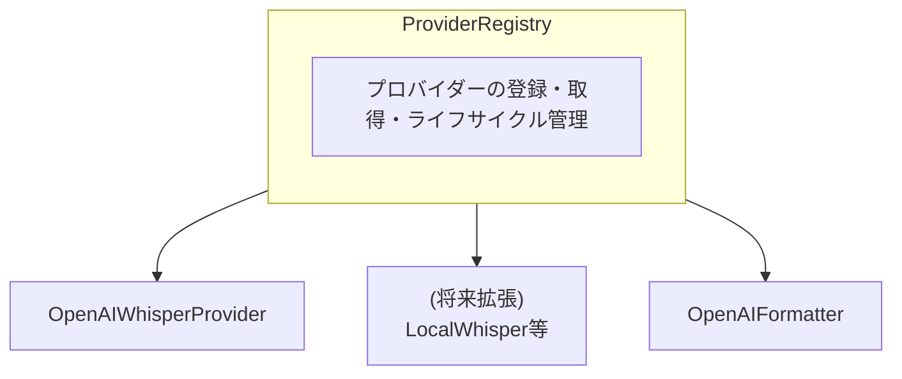
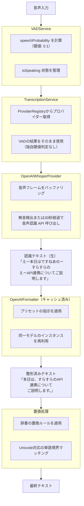
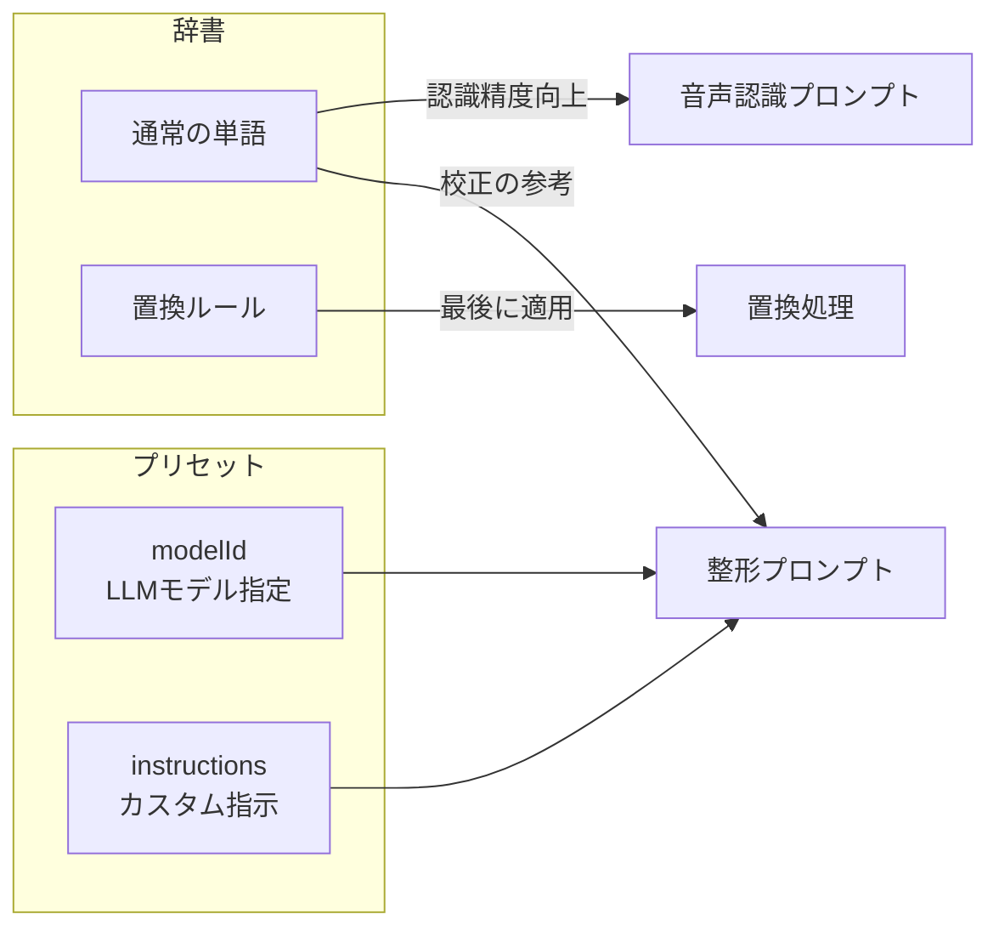
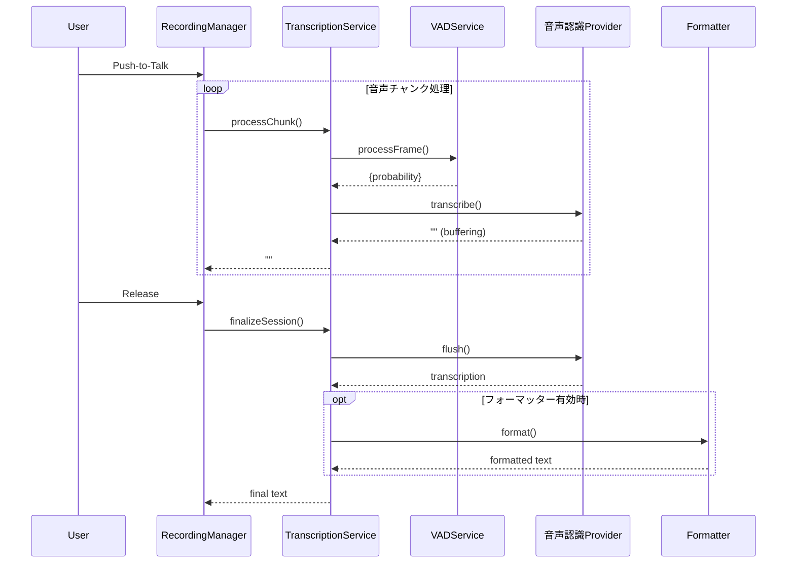
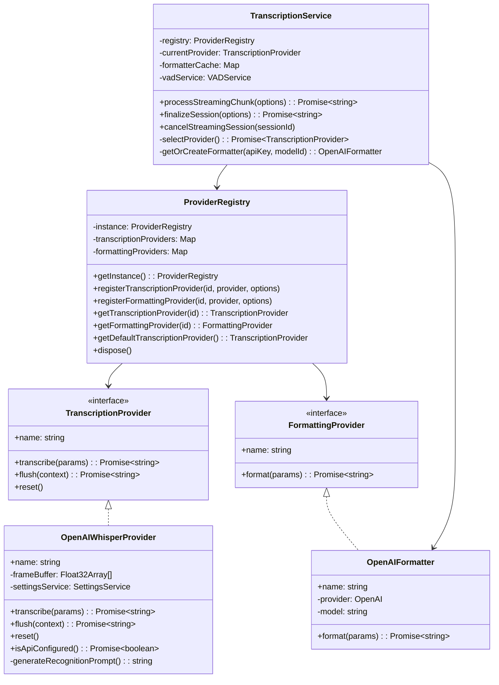

# 音声処理パイプライン

音声入力から最終テキスト出力までの処理フローと、各コンポーネントの役割を説明します。

---

## アーキテクチャ概要



### 主要コンポーネント

| コンポーネント | 役割 |
|---------------|------|
| `ProviderRegistry` | プロバイダーの登録・取得・破棄を一元管理（シングルトン） |
| `TranscriptionService` | パイプライン全体の制御、セッション管理 |
| `VADService` | 音声区間検出（Voice Activity Detection） |
| `OpenAIWhisperProvider` | 音声認識 API による音声認識 |
| `OpenAIFormatter` | LLM API によるテキスト整形 |

---

## 処理フロー



---

## ProviderRegistry

プロバイダーの登録・取得・破棄を一元管理するシングルトンクラス。

### 主要メソッド

```typescript
// インスタンス取得
const registry = ProviderRegistry.getInstance();

// プロバイダー登録
registry.registerTranscriptionProvider("openai-whisper", provider, { isDefault: true });
registry.registerFormattingProvider("openai", formatter);

// プロバイダー取得
const transcriber = registry.getTranscriptionProvider("openai-whisper");
const formatter = registry.getFormattingProvider("openai");

// デフォルトプロバイダー取得
const defaultTranscriber = registry.getDefaultTranscriptionProvider();

// プロバイダー一覧
const ids = registry.getTranscriptionProviderIds(); // ["openai-whisper"]

// クリーンアップ
await registry.dispose();
```

### 将来の拡張

新しいプロバイダーを追加する場合：

1. `TranscriptionProvider` または `FormattingProvider` インターフェースを実装
2. `ProviderRegistry` に登録
3. 設定から `providerId` を読み取り、`selectProvider()` で切り替え

```typescript
// 例: LocalWhisperProvider を追加
class LocalWhisperProvider implements TranscriptionProvider {
  readonly name = "local-whisper";
  async transcribe(params: TranscribeParams): Promise<string> { ... }
  async flush(context: TranscribeContext): Promise<string> { ... }
  reset(): void { ... }
}

// 登録
registry.registerTranscriptionProvider("local-whisper", new LocalWhisperProvider());

// 設定で切り替え
// pipelineSettings.transcriptionProviderId = "local-whisper"
```

---

## 辞書とプリセットの役割



### 辞書

| 種類 | 用途 |
|------|------|
| **通常の単語** | 音声認識プロンプトに追加（認識精度向上）、整形プロンプトに追加（校正の参考） |
| **置換ルール** | 最後の置換処理で適用（例: "すらすら" → "株式会社すらすら"） |

### プリセット

| 項目 | 説明 |
|------|------|
| **modelId** | 整形に使用する LLM モデルを指定（例: gpt-4o-mini, gpt-4o） |
| **instructions** | 整形プロンプトに追加するカスタム指示 |

---

## プロンプト詳細

### 1. 音声認識プロンプト

**場所:** `openai-whisper-provider.ts` → `generateRecognitionPrompt()`

```typescript
// 実際の生成ロジック
const prompt = [辞書の単語].join(", ") + " " + [前の認識テキスト]
```

**効果:**
- 音声認識 API は `prompt` パラメータの単語を優先的に認識する
- 専門用語や固有名詞の認識精度が向上

---

### 2. 整形プロンプト

**場所:** `formatter-prompt.ts` → `constructFormatterPrompt()`

**構成順:**

| 順番 | 内容 | 条件 |
|:----:|------|------|
| 1 | 出力ルール（必須） | 常に |
| 2 | 整形ルール | プリセット指示 or デフォルト指示 |
| 3 | 辞書 | 辞書が存在する場合 |

**出力ルール（固定）:**
- 整形したテキストを `<formatted_text>` タグで囲んで出力
- タグの外には何も書かない
- 空入力は空タグを返す

**デフォルト整形ルール:**
- 句読点を適切に配置する
- フィラー（えー、あのー、まあ等）を除去する
- 読みやすい文章にする
- 元の意味やトーンを維持する

---

## 設定

### パイプライン設定

`SettingsService.getPipelineSettings()` で取得可能な設定:

| 設定名 | 説明 | デフォルト |
|--------|------|----------|
| `transcriptionProviderId` | 使用する音声認識プロバイダーID | `"openai-whisper"` |
| `formattingProviderId` | 使用するフォーマッタープロバイダーID | (未使用) |

### VAD設定

`VADService` の定数:

| 設定名 | 値 | 説明 |
|--------|-----|------|
| `SPEECH_THRESHOLD` | 0.1 | 音声検出の閾値 |
| `REDEMPTION_FRAMES` | 8 | 無音判定までのフレーム数 |
| `WINDOW_SIZE_SAMPLES` | 512 | 1フレームのサンプル数（32ms） |

### OpenAIWhisperProvider設定

| 設定名 | 値 | 説明 |
|--------|-----|------|
| `MAX_SILENCE_DURATION_MS` | 3000 | 無音継続で音声認識実行するまでの時間 |
| `IGNORE_FULLY_SILENT_CHUNKS` | true | 完全無音チャンクをスキップ |

---

## 関連ファイル

| ファイル | 役割 |
|----------|------|
| `pipeline/core/provider-registry.ts` | プロバイダー管理 |
| `pipeline/core/pipeline-types.ts` | インターフェース定義 |
| `pipeline/core/context.ts` | パイプラインコンテキスト |
| `services/transcription-service.ts` | パイプライン全体の制御 |
| `services/vad-service.ts` | 音声区間検出 |
| `services/settings-service.ts` | 設定管理 |
| `pipeline/providers/transcription/openai-whisper-provider.ts` | 音声認識 API 呼び出し |
| `pipeline/providers/formatting/openai-formatter.ts` | LLM API 呼び出し |
| `pipeline/providers/formatting/formatter-prompt.ts` | 整形プロンプト生成 |
| `pipeline/index.ts` | モジュールエクスポート |

---

## シーケンス図



---

## クラス図


