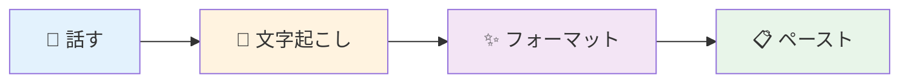
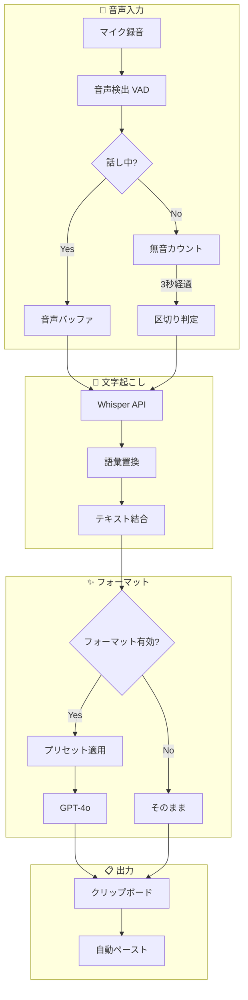

# フォーマットプリセット機能 設計書

## 概要

音声入力後のフォーマット処理をカスタマイズ可能にし、最大5つのプリセットとして保存できる機能。
また、音声処理フローをユーザーにわかりやすく説明するヘルプ機能も含む。

## 背景・課題

### 現状
- フォーマットプロンプトは `formatter-prompt.ts` にハードコード
- ユーザーがカスタマイズできない
- アプリ種別（Email/Chat/Notes）は自動判定のみ
- 音声処理の流れが一般ユーザーにはわかりにくい

### 関連ファイル
| ファイル | 説明 |
|---------|------|
| `src/pipeline/providers/formatting/formatter-prompt.ts` | プロンプト構築 |
| `src/pipeline/providers/formatting/openai-formatter.ts` | LLMフォーマット実行 |
| `src/db/app-settings.ts` | 設定の永続化 |
| `src/renderer/main/pages/settings/dictation/components/FormattingSettings.tsx` | 設定UI |

---

## 機能仕様

### 1. フォーマットプリセット

#### プリセット構造
```typescript
interface FormatPreset {
  id: string;
  name: string;                    // "議事録", "メール文" など
  modelId: "gpt-4o-mini" | "gpt-4o";
  instructions: string;            // カスタムプロンプト
  isDefault: boolean;              // デフォルトプリセットか
  createdAt: Date;
  updatedAt: Date;
}

interface FormatterConfig {
  enabled: boolean;
  presets: FormatPreset[];         // 最大5つ
  activePresetId: string | null;   // 現在選択中
  autoSelectByApp: boolean;        // アプリ種別で自動選択
}
```

#### 制約
- プリセット数: 最大5つ
- 名前: 必須、最大20文字
- 指示文: 最大2000文字

---

## UI設計

### 設定画面: プリセット一覧

```
┌─────────────────────────────────────────────────────────┐
│  フォーマット設定                                         │
├─────────────────────────────────────────────────────────┤
│                                                         │
│  ◉ フォーマットを有効にする                    [トグル]   │
│                                                         │
│  ─────────────────────────────────────────────────────  │
│                                                         │
│  プリセット（最大5つ）                    [+ 新規作成]    │
│                                                         │
│  ┌─────────────┐ ┌─────────────┐ ┌─────────────┐       │
│  │ ★ 標準     │ │   議事録    │ │  メール文   │       │
│  │             │ │             │ │             │       │
│  │ GPT-4o-mini│ │ GPT-4o     │ │ GPT-4o-mini│       │
│  │ [デフォルト]│ │             │ │             │       │
│  └─────────────┘ └─────────────┘ └─────────────┘       │
│                                                         │
│  ┌─────────────┐ ┌─────────────┐                       │
│  │   箇条書き  │ │  カジュアル │                       │
│  │             │ │             │                       │
│  │ GPT-4o-mini│ │ GPT-4o-mini│                       │
│  └─────────────┘ └─────────────┘                       │
│                                                         │
└─────────────────────────────────────────────────────────┘
```

### プリセット編集ダイアログ

```
┌─────────────────────────────────────────────────────────┐
│  プリセットを編集                              [×]      │
├─────────────────────────────────────────────────────────┤
│                                                         │
│  名前                                                   │
│  ┌─────────────────────────────────────────────────┐   │
│  │ 議事録                                          │   │
│  └─────────────────────────────────────────────────┘   │
│                                                         │
│  モデル                                                 │
│  ┌─────────────────────────────────────────────────┐   │
│  │ GPT-4o（高品質）                            ▾  │   │
│  └─────────────────────────────────────────────────┘   │
│                                                         │
│  フォーマット指示                                       │
│  ┌─────────────────────────────────────────────────┐   │
│  │ 以下のルールに従って整形してください：           │   │
│  │                                                 │   │
│  │ - 発言者ごとに段落を分ける                      │   │
│  │ - 決定事項は【決定】で始める                    │   │
│  │ - TODOは「□」でリスト化する                    │   │
│  │ - 日時は「YYYY/MM/DD」形式で統一               │   │
│  │                                                 │   │
│  └─────────────────────────────────────────────────┘   │
│                                                         │
│  プレビュー                               [テスト実行]   │
│  ┌─────────────────────────────────────────────────┐   │
│  │ (入力例と出力例が表示される)                    │   │
│  └─────────────────────────────────────────────────┘   │
│                                                         │
│            [キャンセル]  [デフォルトに設定]  [保存]     │
└─────────────────────────────────────────────────────────┘
```

### プリセット切り替え方法

#### 案A: ウィジェットから切り替え
```
┌──────────────────┐
│  🎤 録音中...    │
│                  │
│  プリセット:     │
│  [標準 ▾]        │
└──────────────────┘
```

#### 案B: ショートカットキー
- `Cmd+1〜5` でプリセット切り替え
- 録音前/録音中どちらでも変更可能

#### 案C: 自動判定 + 手動オーバーライド（推奨）
- デフォルトはアプリ種別で自動選択
- ウィジェットでオーバーライド可能

---

## ヘルプ機能: 音声処理フロー図

### シンプル版（一般ユーザー向け）



### 詳細版（パワーユーザー向け）



### ヘルプダイアログUI

```
┌─────────────────────────────────────────────────────────┐
│  音声入力の仕組み                              [×]      │
├─────────────────────────────────────────────────────────┤
│                                                         │
│  [簡易表示] [詳細表示]                                  │
│                                                         │
│  ┌───────────────────────────────────────────────────┐ │
│  │                                                   │ │
│  │   🎤 ──→ 📝 ──→ ✨ ──→ 📋                       │ │
│  │   話す    文字    整形    ペースト                │ │
│  │          起こし                                   │ │
│  │                                                   │ │
│  └───────────────────────────────────────────────────┘ │
│                                                         │
│  各ステップの説明:                                      │
│                                                         │
│  🎤 話す                                               │
│     マイクに向かって話すと、音声が録音されます。        │
│     3秒の無音で自動的に区切りを検出します。             │
│                                                         │
│  📝 文字起こし                                         │
│     OpenAI Whisper が音声をテキストに変換します。       │
│     登録した語彙は優先的に認識されます。                │
│                                                         │
│  ✨ フォーマット（オプション）                         │
│     AIが文章を読みやすく整形します。                    │
│     プリセットで出力形式をカスタマイズできます。        │
│                                                         │
│  📋 ペースト                                           │
│     変換されたテキストが自動的にペーストされます。      │
│                                                         │
└─────────────────────────────────────────────────────────┘
```

---

## 実装計画

### フェーズ1: 基盤（P1）

| タスク | 説明 |
|-------|------|
| ヘルプ図の実装 | Mermaidまたは静的画像でフロー図を表示 |
| DB スキーマ拡張 | `FormatPreset` テーブル追加 |
| 単一プリセット保存 | 1つのカスタムプリセットを保存可能に |

### フェーズ2: 拡張（P2）

| タスク | 説明 |
|-------|------|
| 複数プリセット対応 | 最大5つまで保存 |
| プリセット一覧UI | カード形式の一覧表示 |
| ウィジェット連携 | 録音中のプリセット切り替え |

### フェーズ3: 高度な機能（P3）

| タスク | 説明 |
|-------|------|
| プレビュー機能 | テスト入力で出力を確認 |
| 自動選択ルール | アプリごとのプリセット自動適用 |
| インポート/エクスポート | プリセットの共有機能 |

---

## 技術的な実装メモ

### プロンプト構築の変更

現在の `constructFormatterPrompt()` を拡張:

```typescript
// 現在
function constructFormatterPrompt(
  text: string,
  context?: AccessibilityContext
): string

// 変更後
function constructFormatterPrompt(
  text: string,
  context?: AccessibilityContext,
  preset?: FormatPreset  // プリセットを受け取る
): string
```

### Mermaid レンダリング

オプション:
1. **mermaid.js** をレンダラーにバンドル
2. **静的SVG** として事前生成
3. **react-mermaid** コンポーネント使用

推奨: 静的SVGが最もシンプル（ヘルプ内容は固定のため）

---

## 参考: プリセット例

### 議事録
```
以下のルールに従って整形してください：
- 発言者ごとに段落を分ける
- 決定事項は【決定】で始める
- TODOは「□」でリスト化する
- 日時は「YYYY/MM/DD」形式で統一
```

### メール文
```
ビジネスメールとして整形してください：
- 敬語を適切に使用
- 段落ごとに改行を入れる
- 結びの挨拶を追加
```

### 箇条書き
```
内容を箇条書きで整理してください：
- 主要なポイントを抽出
- 階層構造で整理
- 簡潔な表現に
```

### カジュアル
```
友達に話すような文体に変換してください：
- 敬語は使わない
- 「〜だね」「〜だよ」などの語尾
- 絵文字は使わない
```
